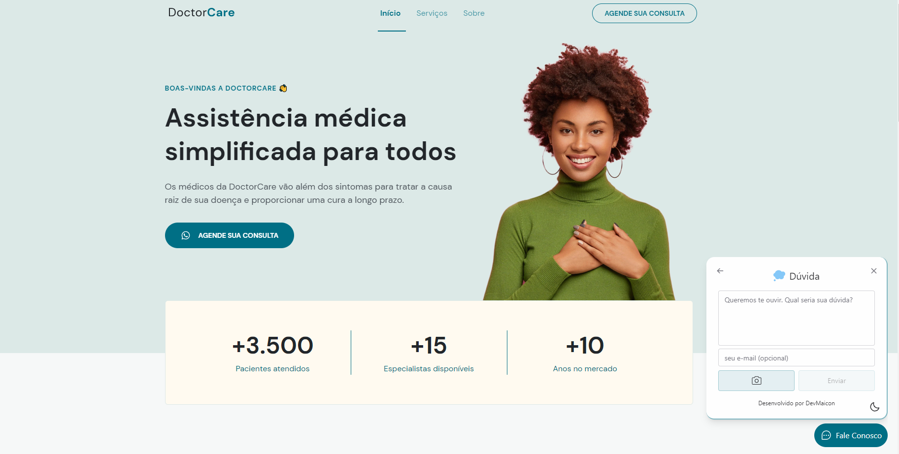

<h1 align="center">NLW Return - Origin </h1>


<p align="center">
  
</p>

## 🧪 Tecnologias

Esse projeto foi desenvolvido com as seguintes tecnologias:

- Html
- Css
- JavaScript


## 🚀 Como executar

Clone o repositório e acesse a pasta.

```bash
$ git clone https://github.com/devmaicon85/docter-care-lading-page

# entrar na pasta do projeto
$ cd docter-care-lading-page


# Para iniciar o projeto com LiveServer
Com extensão liveserver instalada, clique com o botão direito em cima de index.html > Abrir com LiveServer

ou apenas abra o arquivo index.html em seu navegador
```

## 💻 Projeto

O projeto é uma aplicação é uma lading page em html, css e javascript

Este é um projeto desenvolvido durante a **[Next Level Week](https://www.rocketseat.com.br)**, apresentado pela Rocketseat.

## 🔖 Layout

Você pode visualizar o layout do projeto original através do link abaixo:

- [Layout Web](https://www.figma.com/community/file/1102912263666619803/DoctorCare)


## 🔖 NextLevel

Implementei nesse projeto um script que implanta automaticamente o Feedback Widget - Projeto completo que realizei completo também na NLW

O projeto do Feedback Widget:

- [https://github.com/devmaicon85/widget](https://github.com/devmaicon85/widget)


Esse projeto está sob a licença MIT.

---

Feito com 💜 by @devmaicon85 👋🏻 [Siga-me para acompanhar novos projetos!](https://github.com/devmaicon85/)
